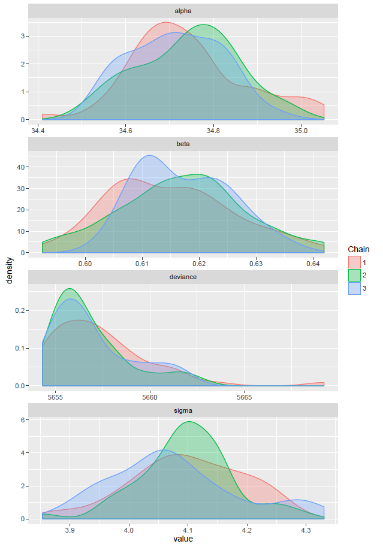
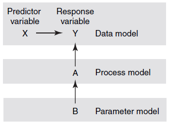

```{r knitr_setup, include=FALSE, cache=FALSE}

library(knitr)

### Chunk options ###

## Text results
opts_chunk$set(echo = FALSE, warning = FALSE, message = FALSE, eval = TRUE, size = 'footnotesize')

## Code decoration
opts_chunk$set(tidy = FALSE, comment = NA, highlight = TRUE, prompt = FALSE, crop = TRUE)

# ## Cache
opts_chunk$set(cache = TRUE, cache.path = "knitr_output/cache/")

# ## Plots
opts_chunk$set(fig.path = "knitr_output/figures/")
opts_chunk$set(fig.align = 'center')

### Hooks ###
## Crop plot margins
knit_hooks$set(crop = hook_pdfcrop)

## Reduce font size
# see http://stackoverflow.com/a/39961605
knit_hooks$set(smallfont = function(before, options, envir) {
  if (before) return(paste0("\n \\", options$size, "\n\n"))
  else return("\n\n \\normalsize \n")
  })

```


## Bayesian modelling is growing fast

```{r out.width='4in', out.height='2in'}

```

- Powerful
- Flexible
- Knowledge synthesis
- Uncertainty


----

Even if you don't become Bayesian today,

this workshop will help you to understand

regression and 'mixed-effects' models better.


----

*The purpose of models is not to fit data,*

*but to sharpen the questions*


Samuel Karlin


## Practical workshop: we'll see main concepts, but do read the literature!

**General**

- [Data analysis using regression and multilevel/hierarchical models](http://www.stat.columbia.edu/~gelman/arm/)

- [Statistical Rethinking: A Bayesian Course with Examples in R and Stan](http://xcelab.net/rm/statistical-rethinking/)

- [Bayesian data analysis](http://www.stat.columbia.edu/~gelman/book/)

- [The BUGS book](http://www.crcpress.com/product/isbn/9781584888499)

- [Doing Bayesian data analysis: a tutorial with R, JAGS, and STAN](https://sites.google.com/site/doingbayesiandataanalysis/)

- [Bayesian linear mixed models using Stan: a tutorial](http://www.tqmp.org/RegularArticles/vol12-3/p175/p175.pdf)

- [Bayesian basics](http://m-clark.github.io/docs/IntroBayes.html)

- [Philosophy and the practice of Bayesian statistics](http://www.stat.columbia.edu/~gelman/research/published/philosophy.pdf)


## Practical workshop: we'll see main concepts, but do read the literature!

**Ecology-oriented**

- [The ecological detective: confronting models with data](http://press.princeton.edu/titles/5987.html)

- [Bayesian methods for ecology](http://www.cambridge.org/us/academic/subjects/life-sciences/ecology-and-conservation/bayesian-methods-ecology)

- [Models for ecological data](http://press.princeton.edu/titles/8348.html)

- [Introduction to WinBUGS for ecologists](http://www.mbr-pwrc.usgs.gov/software/kerybook/)

- [Applied hierarchical modeling in ecology](http://www.mbr-pwrc.usgs.gov/pubanalysis/keryroylebook/)

- [Bayesian Models: A Statistical Primer for Ecologists](http://press.princeton.edu/titles/10523.html)


- and more...


## Bayesian modelling software

- WinBUGS/OpenBUGS
- JAGS
- STAN
- Filzbach
- Nimble
- Many R packages: MCMCpack, MCMCglmm, LaplacesDemon, r-inla, etc (see [Bayesian task view](http://cran.r-project.org/web/views/Bayesian.html))


## We'll focus on JAGS and STAN

- Fast, powerful, and most popular
- Similar to BUGS 
- Easy to start
- Open-ended modelling: deal with complex models too
- But look for specific implementations of your analysis (e.g. hSDM, rstanarm)
- Once concepts understood, switching software not difficult


## JAGS has to be installed independently

http://mcmc-jags.sourceforge.net/

Use latest version (4.2.0)


## Calling JAGS from R

- [rjags](https://cran.r-project.org/package=rjags)

- [R2jags](https://cran.r-project.org/package=R2jags)

- [runjags](https://cran.r-project.org/web/packages/runjags/)

- [jagsUI](https://cran.r-project.org/package=jagsUI)

- [dclone](https://cran.r-project.org/package=dclone)

- [rube](http://stat.cmu.edu/~hseltman/rube/)


## Calling STAN from R

- [rstan](https://cran.r-project.org/package=rstan)

- [rstanarm](https://cran.r-project.org/package=rstanarm)

- [rethinking](https://github.com/rmcelreath/rethinking)

- [brms](https://cran.r-project.org/package=brms)


## We will also need these R packages:

```{r echo=TRUE, eval=FALSE, cache=FALSE}
library(arm)
library(R2jags)
library(ggmcmc)
library(shinystan)
library(rube)
library(lme4)
library(rstan)
library(rstanarm)
```

and their dependencies


# The very basics: linear regression


## The very basics: linear regression

\begincols
\begincol

```{r reg1, echo=FALSE, fig.align='left', fig.height=5, fig.width=4}
data(iris)
setosa <- iris[iris$Species == "setosa", ]
plot(setosa[,3], setosa[,4], xlab = "x", ylab = "y", ylim = c(0,0.65), 
     pch=19, las = 1, cex.lab = 1.5)
abline(lm(setosa[,4] ~ setosa[,3]), lwd = 3)
```
\endcol

\begincol
$$
  y_{i} = a + bx_{i} + \epsilon_{i} 
$$

**How many parameters?**

\endcol
\endcols


## The very basics: linear regression


\begincols
\begincol
```{r out.width='2in', out.height='2in'}

```
\endcol

\begincol
$$
  \begin{aligned}
  y_{i} = a + bx_{i} + \epsilon_{i} \\
  \epsilon_{i} \sim N(0, \sigma^2)   
  \end{aligned}
$$

Or also

$$
  \begin{aligned}
  y_{i} \sim N(\mu_{i}, \sigma^2) \\
  \mu_{i} = a + bx_{i} 
  \end{aligned}
$$

\endcol
\endcols


## Our dataset: tree heights and DBH

http://tinyurl.com/treesdata

- One species
- 10 plots
- 1000 trees
- Number of trees per plot ranging from 4 to 392

```{r echo=TRUE}
trees <- read.csv("trees.csv")
summary(trees[, 1:3])
```


## What's the relationship between DBH and height?

```{r echo=FALSE}
plot(trees$dbh, trees$height, pch=20, las=1, cex.lab=1.4, xlab="DBH (cm)", ylab="Height (m)")
```


## First step: linear regression (lm)

```{r lm, echo=TRUE, message=FALSE}
simple.lm <- lm(height ~ dbh, data = trees)
arm::display(simple.lm)  # summary of key model elements
```

**Interpretation?**


## Always centre continuous variables

```{r echo=TRUE}
summary(trees$dbh)
trees$dbh.c <- trees$dbh - 25
```

So, all parameters will be referred to a 25 cm DBH tree.


## Linear regression with centred DBH

\begincols
\begincol
```{r echo=FALSE, fig.align='left', fig.width=4, fig.height=4}
plot(trees$dbh.c, trees$height, pch=20, las=1, cex.lab=1.4, xlab="DBH (cm)", ylab="Height (m)")
abline(lm(height ~ dbh.c, data=trees), col="red", lwd=3)
```
\endcol

\begincol

```{r echo=FALSE, smallfont=TRUE, cache=FALSE}
library(arm)
simple.lm <- lm(height ~ dbh.c, data = trees)
display(simple.lm)
```
\endcol
\endcols


## Let's make it Bayesian

**Things we'll need**

- A function describing the model (including **priors**)
- Data
- Choose parameters to save
- Define initial values for MCMC chains
- Decide number of iterations (and burnin)


## Remember our model structure

$$
  \begin{aligned}
  y_{i} \sim N(\mu_{i}, \sigma^2) \\ 
  \mu_{i} = \alpha + \beta x_{i} 
  \end{aligned}
$$

In this case:

$$
  \begin{aligned}
  Height_{i} \sim N(\mu_{i}, \sigma^2)  \\
  \mu_{i} = \alpha + \beta DBH_{i} 
  \end{aligned}
$$

$\alpha$: expected height when DBH = 0

$\beta$: how much height increases with every unit increase of DBH


## JAGS uses precision instead of variance

$$
\tau = \frac{1}{\sigma^2} 
$$
So, residual variance $\sigma^2 = 100$ expressed as $\tau = 0.01$.


## Specify the model as an R function

$$
  \begin{aligned}
  Height_{i} \sim N(\mu_{i}, \sigma^2)  \\
  \mu_{i} = \alpha + \beta DBH_{i} 
  \end{aligned}
$$

```{r echo=TRUE}
bayes.lm <- function(){
  
  # LIKELIHOOD
  for (i in 1:length(height)){
    height[i] ~ dnorm(mu[i], tau)    # tau=precision (inverse var)
    mu[i] <- alpha + beta*dbhc[i]    # expected height ~ dbhc
  }

}
```


## We need priors for every parameter!

```{r echo=TRUE, smallfont=TRUE}
bayes.lm <- function(){
  
  # LIKELIHOOD
  for (i in 1:length(height)){
    height[i] ~ dnorm(mu[i], tau)    # tau = precision (inverse var)
    mu[i] <- alpha + beta*dbhc[i]    # expected height ~ dbhc
  }
  
  # PRIORS (vague or weakly informative)
  alpha ~ dunif(1, 100)     # prior avg height of 25-cm-DBH tree
  beta ~ dunif(0, 10)       # how much do we expect height to scale with DBH?
  tau <- 1/(sigma*sigma)    # tau = 1/sigma^2
  sigma ~ dunif(0, 50)      # residual standard deviation
}
```


## A note on priors

Avoid 'non-informative' priors (see [this](http://andrewgelman.com/2013/11/21/hidden-dangers-noninformative-priors/) and [this](https://normaldeviate.wordpress.com/2013/07/13/lost-causes-in-statistics-ii-noninformative-priors/))

Use *weakly informative* (e.g. bounded Uniform, Normal with reasonable parameters, Cauchy...)    

or *strongly informative* priors based on previous knowledge and common sense.

Some tips for setting priors: 

- https://github.com/stan-dev/stan/wiki/Prior-Choice-Recommendations

- http://www.mrc-bsu.cam.ac.uk/wp-content/uploads/bugsbook_chapter5.pdf

Usually good idea to try different priors and evaluate posterior sensitivity

Or run model without likelihood (priors only).


## Example: estimating people height across countries


\begincols
\begincol

Unreasonable prior

```{r echo=1, fig.height=3, fig.width=3, fig.align='left'}
plot(density(rnorm(1000, 0, 1000)),   
     main="", xlab="Height (m)")
```
\endcol

\begincol

Reasonable prior

```{r echo=1, fig.height=3, fig.width=3, fig.align='left'}
plot(density(rnorm(1000, 2, 0.5)),   
      main="", xlab="Height (m)")
```
\endcol
\endcols

(*from STAN manual*)


## We already have our model definition

```{r echo=TRUE}
bayes.lm <- function(){
  
  # LIKELIHOOD
  for (i in 1:length(height)){
    height[i] ~ dnorm(mu[i], tau)    # tau = precision (inverse of variance)
    mu[i] <- alpha + beta*dbhc[i]    # centred diameter
  }
  
  # PRIORS (vague or weakly informative)
  alpha ~ dunif(1, 100)     # prior for average height of a 25-cm-DBH tree
  beta ~ dunif(0, 10)       # how much do we expect height to scale with DBH?
  tau <- 1/(sigma*sigma)    # tau = 1/sigma^2
  sigma ~ dunif(0, 50)      # residual standard deviation
}
```


## Next step: create list with data

Data = known values

```{r echo=TRUE}
data <- list(height = trees$height,  # response
             dbhc = trees$dbh.c)     # predictor
```


## Next step: choose parameters to save

```{r echo=TRUE}
params <- c("alpha", "beta", "sigma")
```


## Now call JAGS to run the model


```{r echo=TRUE, cache=FALSE}
library(R2jags)
```

```{r echo=TRUE, results='hide'}
m1 <- jags(data,  
           model.file = bayes.lm,  
           parameters.to.save = params,  
           n.chains = 3,  
           inits = NULL,   # JAGS will create inits for each chain
           n.iter = 10,    # number of iterations
           n.burnin = 5)   # iterations to discard (before convergence)
```

 

## Traceplots: viewing MCMC in action

```{r echo=1, fig.height=5, fig.width=6}
traceplot(m1, ask = FALSE, mfrow = c(2, 2))
par(mfrow=c(1,1))
```

Obviously we haven't achieved convergence yet...


## Viewing MCMC in action (II)

[](http://mbjoseph.github.io/images/metrop.gif)

Source: http://mbjoseph.github.io/2013/09/08/metropolis.html


## Let's run JAGS for longer

```{r echo=TRUE, results='hide'}
m1 <- jags(data,  
           model.file = bayes.lm,  
           parameters.to.save = params,  
           n.chains = 3,  
           inits = NULL,  
           n.iter = 10000,    # 10000 MCMC iterations
           n.burnin = 5000)   # discard first half (5000 iterations)
```


## Use traceplots to asess convergence

```{r echo=1}
traceplot(m1, ask = FALSE, mfrow = c(2, 2))
par(mfrow=c(1,1))
```


## Results: parameter estimates

```{r echo=FALSE}
print(m1, intervals=c(0.025, 0.975))
```


## Compare with `simple.lm`

```{r}
display(simple.lm)
```

Results pretty similar, because of vague priors

 

## A plot of the whole model

```{r fig.height=7, fig.width=9}
plot(m1)
```


# Model checking 

## Using ggmcmc to produce diagnostic plots

```{r echo=TRUE}
suppressPackageStartupMessages(library(ggmcmc))
m1.mcmc <- as.mcmc(m1)   # Get list of MCMC values
m1.tidy = ggs(m1.mcmc)   # Produce tidy data frame
ggmcmc(m1.tidy)
```


This generates a PDF file with diagnostic plots for all parameters! (`ggmcmc-output.pdf`)


## ggmcmc output sample

\begincols
\begincol
```{r}

```
\endcol

\begincol
```{r}

```
\endcol
\endcols


## shinystan: assess model interactively

```{r eval=FALSE, echo=TRUE}
library(shinystan)
launch_shinystan(as.shinystan(m1.mcmc))
```


## Comparing prior and posterior

```{r echo=FALSE, eval=FALSE}
curve(dunif(x, 1, 100), from = 1, to = 100, 
      lwd = 2, col = "red", main="Height of average 25-cm DBH tree (alpha)", xlab="Height (m)", ylab = "", 
      las = 1, ylim = c(0, 0.1))
lines(density(m1$BUGSoutput$sims.list$alpha), lwd=2, col="blue")
legend("topright", c("prior", "posterior"), col = c("red", "blue"), lty = 1, bty = "n")

```


## Comparing prior and posterior

```{r echo=TRUE, cache=FALSE}
library(rube)
priPost(post = m1$BUGSoutput$sims.list$alpha[, 1], 
        dist = "Uniform", pripar = c(1, 100))
```


## Comparing prior and posterior (sigma)

```{r echo=TRUE}
priPost(post = m1$BUGSoutput$sims.list$sigma[, 1], 
        dist = "Uniform", pripar = c(0, 50))
```


## Observed vs Predicted values

```{r echo=FALSE}
alpha.avg <- mean(m1$BUGSoutput$sims.list$alpha)
beta.avg <- mean(m1$BUGSoutput$sims.list$beta)
mu <- alpha.avg + beta.avg*trees$dbh.c
plot(trees$height, mu, 
     xlim = c(0, 60), ylim = c(0, 60),
     xlab = "Observed height (m)", ylab = "Predicted height (m)")
abline(a = 0, b = 1)
```

How would you do this?


## Observed vs Predicted values

```{r echo=TRUE, fig.height=3, fig.width=4}
alpha.avg <- mean(m1$BUGSoutput$sims.list$alpha)
beta.avg <- mean(m1$BUGSoutput$sims.list$beta)
mu <- alpha.avg + beta.avg*trees$dbh.c
plot(trees$height, mu, 
     xlim = c(0, 60), ylim = c(0, 60),
     xlab = "Observed height (m)", ylab = "Predicted height (m)")
abline(a = 0, b = 1)
```


## Residuals

```{r echo=FALSE}
residuals <- trees$height - mu
hist(residuals)
```


## posterior predictive distribution


# Now using Normal vague priors


## Model with Normal priors

```{r echo=TRUE}
bayes.lm.N <- function(){
  
  # LIKELIHOOD
  for (i in 1:length(height)){
    height[i] ~ dnorm(mu[i], tau)    # tau = precision (inverse of variance)
    mu[i] <- alpha + beta*dbhc[i]    # centred diameter
  }
  
  # PRIORS 
  alpha ~ dnorm(0, 0.01)      # prior for intercept
  beta ~ dnorm(0, 0.01)       # prior for beta (slope)
  tau <- 1/(sigma*sigma)      # tau = 1/sigma^2
  sigma ~ dunif(0, 50)        # residual standard deviation
}
```


## Calling JAGS

```{r echo=TRUE, results='hide'}
m1b <- jags(data,  
           model.file = bayes.lm.N,  
           parameters.to.save = params,  
           n.chains = 3,  
           inits = NULL,  
           n.iter = 4000,  
           n.burnin = 2000)  
```


## Results with Normal priors on intercept and slope

```{r echo=FALSE}
print(m1b, intervals=c(0.025, 0.975))
```


Very similar


## Let's try strongly informative prior on alpha

```{r echo=TRUE}
bayes.lm.N2 <- function(){
  
  # LIKELIHOOD
  for (i in 1:length(height)){
    height[i] ~ dnorm(mu[i], tau)    # tau = precision (inverse of variance)
    mu[i] <- alpha + beta*dbhc[i]    # centred diameter
  }
  
  # PRIORS 
  alpha ~ dnorm(10, 10)      # prior for intercept
  beta ~ dnorm(0, 0.01)      # prior for beta (slope)
  tau <- 1/(sigma*sigma)     # tau = 1/sigma^2
  sigma ~ dunif(0, 50)       # residual standard deviation
}
```


## Calling JAGS

```{r echo=TRUE, results='hide'}
m1c <- jags(data,  
           model.file = bayes.lm.N2,  
           parameters.to.save = params,  
           n.chains = 3,  
           inits = NULL,  
           n.iter = 4000,  
           n.burnin = 2000)  
```


## Posteriors: between prior and likelihood

```{r echo=FALSE}
print(m1c, intervals=c(0.025, 0.975))
```


## Prior vs Posterior

```{r echo=TRUE}
priPost(post = m1c$BUGSoutput$sims.list$alpha[,1],
        dist = "Normal", pripar = c(10, 0.1))
```


# Bayesian inference

## Bayes theorem: prior, likelihood, posterior


$$
P(Hypothesis | Data) = \frac{P(Data | Hypothesis) P(Hypothesis)}{P(Data)}
$$


$$
P(Hypothesis | Data) \propto P(Data | Hypothesis) \times P(Hypothesis)
$$


$$
Posterior \propto Likelihood \times Prior
$$

Hence, prior influence decreases with size of data set.


# Varying-intercept models


## Accounting for plot effects

```{r echo=FALSE}
#plot <- as.numeric(levels(trees$plot))[trees$plot]
plot.id <- factor(trees$plot)
plot(trees$dbh[plot.id==1], trees$height[plot.id==1], 
     pch=20, las=1, cex.lab=1.4, xlab="DBH (cm)", ylab="Height (m)", col=1,
     ylim=c(0,60))
for(i in 2:10){
  points(trees$dbh[plot.id==i], trees$height[plot.id==i], pch=20, col=i)
}
```

**Do it yourself using lm**


## lm results

```{r echo = 1}
lm.plot <- lm(height ~ factor(plot) + dbh.c, data = trees)
display(lm.plot)
```

**Interpretation?**


## Single vs varying intercept

\begincols
\begincol
```{r single_interc, echo=FALSE, fig.height=5, fig.width=4}
plot(height ~ dbh, data=trees, las=1, xlab="DBH (cm)", ylab="Height (m)", ylim = c(0, 60), 
     main = "Pooling all plots")
abline(lm(height ~ dbh, data=trees), lwd=4, col="red")
```
\endcol

\begincol
```{r varying_interc, echo=FALSE, fig.height=5, fig.width=4}
lm2 <- lm(height ~ factor(plot) + dbh, data = trees)
plot(trees$dbh[plot.id==1], trees$height[plot.id==1], 
     pch=20, las=1, xlab="DBH (cm)", ylab="Height (m)", col=1,
     ylim=c(0,60), main = "Different intercept for each plot")
abline(a=coef(lm2)[1], b=coef(lm2)[11], col=1, lwd=2)
for(i in 2:10){
  points(trees$dbh[plot.id==i], trees$height[plot.id==i], pch=20, col=i)
  abline(a=coef(lm2)[1] + coef(lm2)[i], b=coef(lm2)[11], col=i, lwd=2)
}
```
\endcol
\endcols


## Let's make it Bayesian

**Things we'll need**

- A function describing the model (including **priors**)
- Data
- Choose parameters to save
- Define initial values for MCMC chains
- Decide number of iterations (and burnin)


## Bayesian varying-intercept model with no pooling

```{r echo=TRUE}
varint.nopool <- function(){
  # LIKELIHOOD
  for (i in 1:length(height)){
    height[i] ~ dnorm(mu[i], tau)    # tau = precision (inverse of variance)
    mu[i] <- alpha[plot[i]] + beta*dbhc[i]     # centred diameter
  }
  # PRIORS
  #alpha ~ dnorm(0, .001)      # previous model
  for (j in 1:10){
    alpha[j] ~ dnorm(0, .001)  # Plot effects drawn from Normal distribution 
                               # with large **fixed** variance
  }
  beta ~ dnorm(0, .001)
  tau <- 1/(sigma*sigma)       # tau = 1/sigma^2
  sigma ~ dunif(0, 50)
}
```

**This fits same model as `lm.plot`**


## Call JAGS

```{r echo=TRUE, results='hide'}
data <- list(height = trees$height, 
             dbhc = trees$dbh.c, 
             plot = trees$plot)
m2 <- jags(data,  
           model.file = varint.nopool,  
           parameters.to.save = params,  
           n.chains = 3,  
           inits = NULL,  
           n.iter = 4000,  
           n.burnin = 2000) 
```


## Running JAGS in parallel (multiple cores)

```{r echo=TRUE}
m2 <- jags.parallel(data,  
           model.file = varint.nopool,  
           parameters.to.save = params,  
           n.chains = 3,  
           inits = NULL,  
           n.iter = 4000,  
           n.burnin = 2000) 
```


## Results of Bayesian varying intercept model without pooling

```{r echo=FALSE}
print(m2, intervals=c(0.025, 0.975))
```


## Same results as `lm.plot`

```{r}
display(lm.plot)
```

 

## Plot whole model

```{r fig.height=7, fig.width=9, echo=FALSE}
plot(m2)
```


## The varying-intercept model seems better

Based on Deviance Information Criterion (DIC)

DIC(m1) = `r round(m1$BUGSoutput$DIC)`

DIC(m2) = `r round(m2$BUGSoutput$DIC)`

But note DIC (as AIC and BIC) have been criticised

WAIC and cross-validation are preferred alternatives.


## Estimation of plot effects improves with sample size

```{r coefplot1, echo=FALSE}
mean.alpha <- apply(m2$BUGSoutput$sims.list$alpha, 2, mean)
sd.alpha <- apply(m2$BUGSoutput$sims.list$alpha, 2, sd)
coefplot(mean.alpha, sd.alpha, cex.var=1.2, cex.pts=1.5, vertical=FALSE,
         main="Average height of a 25-cm DBH tree in each plot", 
         xlab="Trees per plot", ylim=c(20,40), ylab="Height (m)", cex.lab=1.2,
         var.las=1, varnames=summary(factor(trees$plot)))
```


# Varying-intercepts with pooling (shrinkage)


## Multilevel model with varying intercepts

$$
  \begin{aligned}
  y_{i} = a_{j} + bx_{i} + \varepsilon_{i}  \\
  a_{j} \sim N(0, \tau^2)  \\
  \varepsilon_{i} \sim N(0, \sigma^2) 
  \end{aligned}
$$

In our example:

$$
  \begin{aligned}
  Height_{i} = plot_{j} + bDBH_{i} + \varepsilon_{i}  \\
  plot_{j} \sim N(0, \tau^2)  \\
  \varepsilon_{i} \sim N(0, \sigma^2) 
  \end{aligned}
$$

## Random vs fixed effects

[Many definitions, so much confusion](http://andrewgelman.com/2005/01/25/why_i_dont_use/)

**What is a random effect, really?**

1. Varies by group

2. Variation estimated with probability model

Random effects are estimated with partial pooling, while fixed effects are not (infinite variance).


## Random vs fixed effects

```{r eval=TRUE}
include_graphics("images/mixed_models.pdf")
```


http://www.esourceresearch.org/


## Fitting mixed models with lmer

```{r mixed, echo=2, cache=FALSE}
library(lme4)
mixed <- lmer(height ~ dbh.c + (1|plot), data = trees)
display(mixed)
```


## lmer coefficients

```{r echo=TRUE}
coef(mixed)
```


## Bayesian varying-intercept model with pooling across plots

```{r echo=TRUE}
varint.pool <- function(){
    # LIKELIHOOD
  for (i in 1:length(height)){
    height[i] ~ dnorm(mu[i], tau)    # tau = precision (inverse of variance)
    mu[i] <- alpha[plot[i]] + beta*dbhc[i]     # centred diameter
  }
    # PRIORS
  for (j in 1:10){
    alpha[j] ~ dnorm(grandmu, tauplot)  # Now we are estimating the plot variance!
  }
  grandmu ~ dnorm(0, .001)     # Overall mean height across all plots
  tauplot <- 1/(sigmaplot*sigmaplot)
  sigmaplot ~ dunif(0, 20)     # between-plot variance
  beta ~ dnorm(0, .001)
  tau <- 1/(sigma*sigma)       
  sigma ~ dunif(0, 50)         # residual variance
}
```


## Call JAGS

```{r echo=TRUE}
data <- list(height = trees$height,  
             dbhc = trees$dbh.c,  
             plot = trees$plot)
m3 <- jags.parallel(data,  
           model.file = varint.pool,  
           parameters.to.save = c("alpha", "beta", "sigma", "grandmu", "sigmaplot"),  
           n.chains = 3,  
           inits = NULL,  
           n.iter = 4000,  
           n.burnin = 2000) 
```


## Results of multilevel model with pooling

```{r echo=FALSE}
print(m3, intervals=c(0.025, 0.975))
```


 

## A plot of the whole model

```{r fig.height=7, fig.width=9, echo=FALSE}
plot(m3)
```

 

## Comparing plot coefficients

```{r coefplot1b, echo=FALSE}
mean.alpha <- apply(m2$BUGSoutput$sims.list$alpha, 2, mean)
sd.alpha <- apply(m2$BUGSoutput$sims.list$alpha, 2, sd)
coefplot(mean.alpha, sd.alpha, cex.var=1.2, cex.pts=2, vertical=FALSE,
         main="Average height of a 25-cm DBH tree in each plot", 
         xlab="Trees per plot", ylim=c(20,40), ylab="Height (m)", cex.lab=1.2,
         var.las=1, varnames=summary(factor(trees$plot)))
mean.alpha <- apply(m3$BUGSoutput$sims.list$alpha, 2, mean)
sd.alpha <- apply(m3$BUGSoutput$sims.list$alpha, 2, sd)
coefplot(mean.alpha, sd.alpha, cex.var=1.2, cex.pts=2, vertical=FALSE,
         add=TRUE, offset=0.15, col="red",
         var.las=1, varnames=summary(factor(trees$plot)))

```


## A gradient from complete to no pooling

The multilevel model (with pooling) is somewhere between the complete-pooling (single intercept) and the
no-pooling (one intercept for each plot, without shrinkage) models.

```{r echo=FALSE, fig.height=5, fig.width=8}
par(mfrow=c(1,2))
plot(height ~ dbh, data=trees, las=1, xlab="DBH (cm)", ylab="Height (m)", ylim = c(0, 50), 
     main = "Pooling all plots")
abline(lm(height ~ dbh, data=trees), lwd=4, col="red")

lm2 <- lm(height ~ factor(plot) + dbh, data = trees)
plot(trees$dbh[plot.id==1], trees$height[plot.id==1], 
     pch=20, las=1, xlab="DBH (cm)", ylab="Height (m)", col=1,
     ylim=c(0,50), main = "Different intercept for each plot")
abline(a=coef(lm2)[1], b=coef(lm2)[11], col=1, lwd=2)
for(i in 2:10){
  points(trees$dbh[plot.id==i], trees$height[plot.id==i], pch=20, col=i)
  abline(a=coef(lm2)[1] + coef(lm2)[i], b=coef(lm2)[11], col=i, lwd=2)
}
par(mfrow=c(1,1))
```


# Growing the hierarchy: adding plot-level predictors


## Model with group-level predictors 

We had:

$$
  \begin{aligned}
  y_{i} = a_{j} + bx_{i} + \varepsilon_{i}  \\
  a_{j} \sim N(0, \tau^2)  \\
  \varepsilon_{i} \sim N(0, \sigma^2) 
  \end{aligned}
$$


Now 

$$
  \begin{aligned}
  y_{i} = a_{j} + bx_{i} + \varepsilon_{i}  \\
  a_{j} \sim N(\mu_{j}, \tau^2)  \\
  \mu_{j} = \gamma + \delta \cdot predictor_{j}  \\
  \varepsilon_{i} \sim N(0, \sigma^2)
  \end{aligned}
$$
  


## Reading plot data


```{r read_plotdata, echo=TRUE, message=FALSE}
plotdata <- read.csv("plotdata.csv")
temp.c <- plotdata$temp - 15
```


## Model with group-level predictors

```{r echo=TRUE}
group.preds <- function(){
  # LIKELIHOOD
  for (i in 1:length(height)){
    height[i] ~ dnorm(mu[i], tau)    
    mu[i] <- alpha[plot[i]] + beta*dbhc[i]    
  }
  # PRIORS
  for (j in 1:10){
    alpha[j] ~ dnorm(grandmu + beta.temp*tempc[j], tauplot)   
  }
  beta.temp ~ dnorm(0, .001)   # slope for temperature effects
  grandmu ~ dnorm(0, .001)     
  tauplot <- 1/(sigmaplot*sigmaplot)
  sigmaplot ~ dunif(0, 20)    
  beta ~ dnorm(0, .001)
  tau <- 1/(sigma*sigma)       
  sigma ~ dunif(0, 50)     
}
```


## running JAGS...


```{r echo=TRUE, message=FALSE}

data <- list(height = trees$height, 
             dbhc = trees$dbh.c, 
             plot = trees$plot, 
             tempc = temp.c)
params = c("alpha","beta","sigma", "grandmu", "sigmaplot", "beta.temp")
m4 <- jags.parallel(data,
           model.file = group.preds,
           parameters.to.save = params,
           n.chains = 3,
           inits = NULL,
           n.iter = 4000,
           n.burnin = 2000) 

```


## Average heights among plots related to temperature

```{r echo=FALSE, message=FALSE}
mean.alpha <- apply(m4$BUGSoutput$sims.list$alpha,2, mean)
plot(plotdata$temp, mean.alpha, pch=20, xlab="Temperature", 
     main="Average height of a 25-cm DBH tree in the plot", ylab="Height (m)", 
     cex.lab=1.2, las=1, cex=1.2)

```


## Adding plot-level predictors (pooling) may improve parameter estimation

```{r echo=FALSE}
mean.alpha <- apply(m2$BUGSoutput$sims.list$alpha,2, mean)
sd.alpha <- apply(m2$BUGSoutput$sims.list$alpha,2, sd)
coefplot(mean.alpha, sd.alpha, cex.var=1, cex.pts=1.5, vertical=FALSE,
         main="Average height of a 25-cm DBH tree in each plot", 
         xlab="Trees per plot", ylim=c(20,40), ylab="Height (m)", cex.lab=1,
         var.las=1, varnames=summary(factor(trees$plot)))
mean.alpha <- apply(m4$BUGSoutput$sims.list$alpha,2, mean)
sd.alpha <- apply(m4$BUGSoutput$sims.list$alpha,2, sd)
coefplot(mean.alpha, sd.alpha, cex.var=1, cex.pts=1.5, vertical=FALSE,
         add=TRUE, offset=0.15, col="red",
         var.las=1, varnames=summary(factor(trees$plot)))

```


## Adding plot-level predictors (pooling) may improve parameter estimation


*From Gelman & Hill p. 253*


## Slopes can also vary...

- and coefficients be estimated with pooling
- but taking into account correlation between slopes and intercepts
- (see e.g. Gelman & Hill 2007, ch. 13)


# Recapitulating...


## So what's a multilevel/hierarchical model?

- Parameters/coefficients are given a probability model (with their own hyperparameters estimated from data).

- Intercepts and/or slopes may vary, and can be modelled (sometimes including their own predictors).

 

## Advantages of hierarchical Bayes

- Perfect for structured data (space-time)
- Predictors enter at the appropriate level
- Accommodate variation in treatment effects
- More efficient inference of regression parameters
- Using all the data to perform inferences for groups with small sample size
- Predictions fully accounting for uncertainty and variability
- Prior information


## Datasets are stochastic realisations of a process

\begincols
\begincol
```{r fig.align='left', fig.height=4, fig.width=4, echo=2}
x=seq(from=10, to=20, length.out=100)
data1=rnorm(100, 2 + 1.6*x, 5)
hist(data1)
```
\endcol

\begincol
```{r fig.align='left', fig.height=4, fig.width=4, echo=1}
data2=rnorm(100, 2 + 1.6*x, 5)
hist(data2)
```
\endcol
\endcols


These two datasets are different, even though they arise from same process.

Data inform about process, but have 'noise' too.


## Hierarchical Bayes: data, process, parameters

\begincols
\begincol


\endcol

\begincol


\endcol
\endcols


*Clark et al. 2006, Clark 2007*


# Exercise

----

Does sex influence height?


# Bayesian logistic regression


## Relationship between tree size and mortality

```{r echo=FALSE}
plot(trees$dbh, trees$dead, xlab="DBH", ylab="Dead", pch=20)
```


## Logistic regression model

```{r echo=TRUE}
logreg <- function(){
  
  # LIKELIHOOD
  for (i in 1:length(dead)){
    dead[i] ~ dbern(pdeath[i])
    logit(pdeath[i]) <- mu + beta*dbhc[i]
  }
  
  # PRIORS
  mu ~ dnorm(0, .001)
  beta ~ dnorm(0, .001)
}
```


## Calling JAGS

```{r echo=TRUE, results='hide'}
data <- list(dead = trees$dead,   
             dbhc = trees$dbh.c)
m5 <- jags(data,  
           model.file = logreg,  
           parameters.to.save = c("mu", "beta"),  
           n.chains = 3,  
           inits = NULL,  
           n.iter = 4000,
           n.burnin = 2000) 
```


## Results

```{r echo=FALSE}
print(m5, intervals = c(0.025, 0.975))
# plot(trees$dbh, trees$dead, xlab="DBH", ylab="Dead", pch=20)
# curve(plogis(-3.46+0.05*x), from=5, to=50, add=TRUE, lwd=2)
```


## Compare with glm

```{r echo=1}
logreg <- glm(dead ~ dbh.c, data = trees, family = binomial)
display(logreg)
```


# STAN

----

STAN models are defined similarly to JAGS

(but see STAN manual for differences)


## Our Bayesian linear regression in JAGS

```{r echo=TRUE}
bayes.lm <- function(){
  
  # LIKELIHOOD
  for (i in 1:length(height)){
    height[i] ~ dnorm(mu[i], tau)    # tau = precision (inverse of variance)
    mu[i] <- alpha + beta*dbhc[i]    # centred diameter
  }
  
  # PRIORS (vague or weakly informative)
  alpha ~ dunif(1, 100)     # prior for average height of a 25-cm-DBH tree
  beta ~ dunif(0, 10)       # how much do we expect height to scale with DBH?
  tau <- 1/(sigma*sigma)    # tau = 1/sigma^2
  sigma ~ dunif(0, 50)      # residual standard deviation
}
```


## Bayesian linear regression in STAN

```{r echo=TRUE}
bayes.lm.stan <- "
 
  data {
    int<lower=0> N;
    vector[N] dbhc;
    vector[N] height;
  }

  parameters {
    real<lower=0, upper=100> alpha;
    real<lower=0, upper=10> beta;
    real<lower=0, upper=50> sigma;
  }
  
  model {
    height ~ normal(alpha + beta * dbhc, sigma);
  }
"
```


## Fitting model in STAN

```{r message=FALSE, echo=TRUE, results='hide'}
library(rstan)
lm.stan <- stan(model_code = bayes.lm.stan, 
                data = list(height = trees$height, dbhc = trees$dbh.c, 
                            N = nrow(trees)),
                pars = c("alpha", "beta", "sigma"),
                chains = 3,
                iter = 2000,
                init = "random")
```


## Similar results as JAGS

```{r echo=FALSE}
lm.stan
```


## Lots of example models in STAN

https://github.com/stan-dev/example-models/wiki


# To fit 'standard' Bayesian GLMs and GLMMs, use rstanarm

----

```{r echo=FALSE, out.width="4in", out.height="3in"}
include_graphics("images/rstanarm.png")
```


## Bayesian modelling in one line of code!

```{r message=FALSE, echo=TRUE, results='hide'}
library(rstanarm)
easybayes <- stan_glm(height ~ dbh.c, data = trees, family = gaussian,
                      prior_intercept = normal(30, 30),
                      prior = normal(0, 10))
```

## and results make sense :)

```{r}
easybayes
```


----

```{r}
include_graphics("images/thinkinator.png")
```


## END


Slides and source code available at https://github.com/Pakillo/Bayes-R-JAGS-intro


